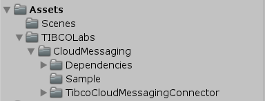

# TIBCO Cloud Messaging Unity3D Package

## Overview
With this Package you can receive real-time Messages within Unity3D.

### Import into Unity3D
Just created a new Unity Project and import the custom Package.


<br><sup>Unity3D Library Assets</sup>

### Configure the Project
1. Drag'n Drop the "Text" Object Prefab into your Scene, afterwards add the MainController to your Scene.
2. Afterwards drag'n drop the "Text" Object to "Msg Text" Field of the Main Controller.
3. Finally, update the Web Socket URI and Authkey with your TIBCO Cloud Subscription Details.


<br><sup>TIBCO Cloud Messaging Configuration</sup>

## sending Messages to Unity3D

### using Flogo
Here a sample using TIBCO Cloud Integration Flogo 


<br><sup>TIBCO Cloud Integration Configuration</sup>

Full sample Data JSON, to copy: 
``` json
{"dataType":"Power","data":"130"}
```

### using cURL
TIBCO Cloud Messaging comes with a REST API, as well. So any REST Tool can be used for testing, too. Just replace [your-key] and [your-id] in the following command:

``` bash
curl -i -u :[your-key] https://messaging.cloud.tibco.com/tcm/TIB_SUB_[your-id]/channel/v1/publish -d '{"dataType":"Power","data":"130"}'
```

> the current Implementation subscribes to all instance messaging destinations. 

## Content
ready to use [Package](https://github.com/TIBCOSoftware/Augmented-Reality/tree/master/packages/TIBCO-Cloud-Messaging/FTL-Basic) | 
Implementation [Source](https://github.com/TIBCOSoftware/Augmented-Reality/tree/master/sources/TIBCO-Cloud-Messaging/FTL-Basic/Assets)

