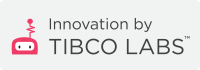

# Welcome to TIBCO LABS™ Augmented Reality

## Overview

|      |      |
| ---- | ---- |
|  | Connect Enterprise Data and take actions is everything in any future Augmented Reality Implementation. The here provided packages allows quick and easy usage of TIBCO Product Offerings inside Augmented Reality Solutions.    We are looking to provide simple connectivity samples to connect to TIBCO Cloud Offerings and On-Prem Products, plus other useful Assets. |

### Technology
All reusable Components implemented for Unity3D using C#, to be used with Google Android Phones and Tablets or Microsoft Hololens v2.

More Details about this Initiative here [TIBCO LABS™ - Augmented Reality Wiki](https://community.tibco.com/wiki/tibco-labstm-augmented-reality-wiki)

## License
Copyright © 2020. TIBCO Software Inc. This file is subject to the license terms contained in the license file that is distributed with this file.

