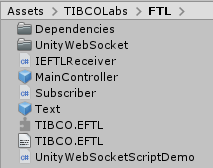
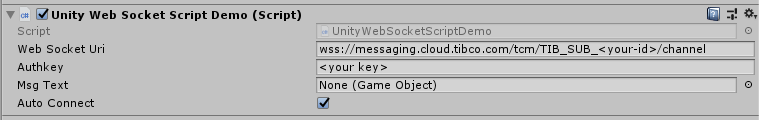

# TIBCO Cloud Messaging Unity3D Package

## Overview
With this Package you can receive real-time Messages within Unity3D.

## Import into Unity3D
Just created a new Unity Project and import the custom Package.

## Configure the Project
Drag'n Drop the "Text" Object Prefab into your Scene, afterwards add the MainController to your Scene.

Afterwards drag'n drop the "Text" Object to "Msg Text" Field of the Main Controller.

Finally, update the Web Socket URI and Authkey with your TIBCO Cloud Subscription Details.

## sending Messages to Unity3D
Here a sample using TIBCO Cloud Integration Flogo 

Sample Data JSON: {"dataType":"Power","data":"130"}

## Hints
the current Implementation subscribes to all destinations. 

