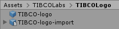

# TIBCO Logos Package

## Overview
With this Package you can used TIBCO Logos within Unity3D.

### Import into Unity3D
Just created a new Unity Project and import the custom Package.

 Unity3D Library Assets

The Package includes a Material: tibStandardBlue, and a Shader: tibStandardShader

### Preview

 TIBCO Logo with MRTK in Unity3D Preview-Mode

## Content
ready to use [Package](https://github.com/TIBCOSoftware/Augmented-Reality/tree/master/packages/TIBCO-Logos) | 
Implementation [Source](https://github.com/TIBCOSoftware/Augmented-Reality/tree/master/sources/TIBCO-Logos/Assets)

